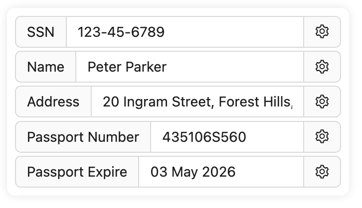

# Digital Identities

Digital identities, or **Avatars**, are what you can use in daily life. Whether it's a login to a website, or a signature on a post, or a message to a friend, you can use your Avatars.

For PWA One, **Avatar Secret key** is the key to generate your digital identity. It's a **Secret Key**.

## 1. Digital Identity Personal Information

**Digital Identity Personal Information** is the personal information of your digital identity.

:::tip

- **Personal Information** can be fake or real.

- The fake part is generated from your **Avatar Secret key**.

- The real part is what you fill in.

:::

here is an example of a digital identity personal information:

## 2. Footprint

**Footprint** is the record of activity for your digital identity.

:::tip

- **Footprint** is fetched from PWA One server.

- **Footprint** is **public**.

- **Footprint** is for you to check and find if someone is **impersonating** you.

:::

## 3. Operations

**Operations** refer to the operations you can do with your digital identity.

:::tip

there are 3 operations:

- **Unlock** Digital identities are unlocked by default.

- **Lock** Once you lock your digital identity, you can't login with it or sign a .

- **Freeze** By freeze, you label your digital identity as frozen. It's a way to tell others that you are not using this digital identity anymore.

And there is a **Contracts** button:

- **Contracts** opens a list of contracts you have signed. So you can manage your contracts at one place.

:::
